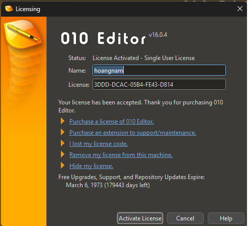

**Yêu cầu**:

- Phân tích cách xác thực của chương trình 010 Editor
- Dựa vào cách xác thực để viết keygen
- Báo cáo, mô tả thuật toán sử dụng

Để tìm đến hàm xử lí serial, name người dùng nhập vào thì chỉ cần nhập tên, license ngẫu nhiên sau đó ấn nút activate và xem mã lỗi báo gì rồi string lỗi đó. Với chương trình này thì làm như vậy đã tìm ra được hàm xử lí nút activate license

- Tạo struct QString: Dựa vào kết quả trả về của hàm `QString::QString()` và docmentation trên mạng

https://doc.qt.io/qt-6/qstring.html

https://doc.qt.io/qt-6/qbytearray.html

https://doc.qt.io/qt-6/qdate.html

```c
00000000 struct __fixed QStringData // sizeof=0x18
00000000 {
00000000                                        
00000000     __int64 ref;
00000008     wchar_t *pData;
00000010     __int64 len;                        
00000018 };
```

- Để kiểm tra xem license có hợp lệ không, chương trình sử dụng một mảng `pSmth` để lưu các dữ liệu `QStringData*` như name và serial người dùng nhập

```c
pSmth[1] = name_data;
pSmth[2] = serial_data;
```

`name_data` và `serial_data` sẽ được cho vào 2 hàm khác nhau để xử lí (em gọi là `fn_first_round` với `fn_second_round`)

`fn_first_round` có tác dụng kiểm tra xem serial có hợp lệ đối với tên người dùng không. Có 2 giá trị trả về là 231 (không hợp lệ) và 147, 78, 45 (hợp lệ)

`fn_second_round` có tác dụng kiểm tra xem loại serial đó thuộc loại gì:

- 219: License hợp lệ, kích hoạt được phần mềm
- 237 hoặc 524: License cho phiên bản cũ, 237 sẽ thông báo khi license cũ và người dùng hết trial, 524 thông báo khi license cũ và người dùng vẫn còn trial
- 113: Tăng thời gian trial

Sau khi nhìn qua 2 hàm thì thấy rằng `fn_second_round` chỉ return 219 nếu `fn_first_round` return 45 => Phân tích và tạo keygen cho phù hợp để đạt được điều kiện trên

# fn_first_round

**fn_serial_to_bytes**: Biến chuỗi serial nhập vào thành như sau (Bỏ qua kí tự `-`): `decoded_byte = Giá trị kí tự i * 16 + Giá trị kí tự i+1` thành một mảng 10 bytes

```c
decoded_bytes[0] = kt0 * 16 + kt1;
decoded_bytes[1] = kt2 * 16 + kt3;

decoded_bytes[2] = kt5 * 16 + kt6;
decoded_bytes[3] = kt7 * 16 + kt8;

decoded_bytes[4] = kt10 * 16 + kt11;
decoded_bytes[5] = kt12 * 16 + kt13;

decoded_bytes[6] = kt15 * 16 + kt16;
decoded_bytes[7] = kt17 * 16 + kt18;

decoded_bytes[8] = kt20 * 16 + kt21;
decoded_bytes[9] = kt22 * 16 + kt23;
```

Mỗi kí tự trong serial (Bỏ qua `-`) sẽ có giá trị được tính bằng hàm **fn_serial_char_transform**:

```c
__int64 __fastcall fn_serial_char_transform(QStringData *pSmth, char serial_char)
{
  if ( (unsigned __int8)(serial_char - 48) <= 9u )
    return (unsigned int)(serial_char - 48);
  if ( ((serial_char - 79) & 0xDF) == 0 )
    return 0;
  if ( serial_char == 'l' )
    return 1;
  if ( (unsigned __int8)(serial_char - 97) <= 0x19u )
    return (unsigned int)(serial_char - 87);
  if ( (unsigned __int8)(serial_char - 65) <= 0x19u )
    return (unsigned int)(serial_char - 55);
  else
    return 0;
}
```

Sau đó chương trình tiếp tục check blacklist rồi `switch(a2_3)` check 3 giá trị `0x9C, 0xFC, 0xAC`

```c
    v14 = a2_7;
    v15 = a2_5;
    v16 = a2_2;
    v17 = a2_1;
    decoded_bytes_1 = decoded_bytes;
    v19 = a2_3;
    switch ( a2_3 ) {
            //.......//
    }
```

`a2_3` ở đây chính là `decoded_bytes[3]`, nếu `a2_3` mà không thuộc 1 trong 3 kí tự trên sẽ luôn return 231 => Invalid license

Vậy phải dựa vào kí tự 7 và 8 trong serial. Dùng script python để tìm các kí tự có thể sử dụng được

```python
def transform(serial_char):
    if (serial_char - 48) & 0xFFFFFFFF <= 9:
        return (serial_char - 48) & 0xFFFFFFFF
    if (serial_char - 79) & 0xDF == 0:
        return 0
    if serial_char == ord('l'):
        return 1
    if (serial_char - 97) & 0xFFFFFFFF <= 0x19:
        return (serial_char - 87) & 0xFFFFFFFF
    if (serial_char - 65) & 0xFFFFFFFF <= 0x19:
        return (serial_char - 55) & 0xFFFFFFFF
    return 0
    
target = [0xAC]

for i in range(32, 127):
    for j in range(32, 127):
        result = (transform(i) * 16 + transform(j)) & 0xFF
        if result in target:
            print(chr(i) + chr(j))
```

> Trong lúc debug với chạy script python thì em thấy rằng các decoded_bytes[i] trùng với target đều có thể giống như target
>
> Ví dụ: Kí tự 7 và 8 là A và C thì `decoded_bytes[3]` vẫn là 0xAC  

Ở đây mỗi `decoded_bytes[3]` sẽ được xử lí khác nhau. Nhìn qua luồng hoạt động của hàm thì thấy rằng hàm chỉ có thể trả về 45 trong trường hợp `decoded_bytes[3] == 0xAC`

## Case 0xFC

Do case này đơn giản hơn và tham số của các hàm cũng đơn giản hơn (Vì serial của case này chỉ được dùng để extend trial) nên sẽ phân tích trước để hiểu qua được luồng hoạt động của phần kiểm tra license

Với `0xFC`, chương trình sẽ gọi một hàm hash custom để hash username mà người dùng nhập vào

```c
case 0xFC:
    v23 = -1;
    HIDWORD(pSmth[4].pData) = 255;
    LODWORD(pSmth[4].len) = 1;
    LODWORD(pSmth[5].pData) = 1;
    goto LABEL_26;
LABEL_26:
    QString::toUtf8(&pSmth[1], name_data_utf8);// name_data
    len = pSmth[4].len;
    LOBYTE(v4) = a2_3_1 != -4;            // if a2_3 == 0xFC != 0xFC should be 0
										  // if a2_3 == 0xAC != 0xFC, should be 1
    name_data_utf8_1 = (QByteArray *)QByteArray::data((QByteArray *)name_data_utf8);
    name_hash = j_fn_name_data_hashing(name_data_utf8_1, v4, v23, len); // name_data_hashing(name_data_utf8_1, 0, 255, 1)
    if ( a2_4 == (_BYTE)name_hash
    	&& (_BYTE)v15 == BYTE1(name_hash)
    	&& a2_6 == BYTE2(name_hash)
    	&& a2_7 == HIBYTE(name_hash) )
    {
```

Viết lại hàm hash trong python, rồi so với kết quả khi debug

Sau đó chương trình tiếp tục check các byte của `decode_bytes` với `name_hash` thì mới tiếp tục

```c
if ( a2_4 == (_BYTE)name_hash
    && (_BYTE)a2_5_1 == BYTE1(name_hash)
    && a2_6 == BYTE2(name_hash)
    && a2_7 == HIBYTE(name_hash) )
{
```

Ví dụ với `name_hash` là `0x8dd84b9b`

- `decoded_bytes[4] == 0x9B`
- `decoded_bytes[5] == 0x4B`
- `decoded_bytes[6] == 0xD8`
- `decoded_bytes[7] == 0x8D`

Vậy với name là `hoangnam` thì serial sẽ phải như sau: `????-??FC-9B4B-D88D`

```c
v29 = j_fn_name_hash_check(decoded_bytes + (a2_1 << 8) + (a2_2 << 16), name_hash);
if ( v29 ) {
	LODWORD(pSmth[4].pData) = v29;
	v28 = 147;
	goto LABEL_41;
}
LABEL_41:
    QByteArray::~QByteArray((QByteArray *)name_data_utf8);
    return v28;

__int64 __fastcall fn_name_hash_check(int a1, int name_hash)
{
  unsigned int v2; // ecx
  __int64 result; // rax

  v2 = (((name_hash ^ a1 ^ 0x22C078) - 180597) ^ 0xFFE53167) & 0xFFFFFF;
  result = 0;
  if ( v2 == 17 * (v2 / 0x11) )
    return v2 / 0x11;
  return result;
}
```

`a1 = decoded_bytes[0] + (decoded_bytes[1] << 8) + (decoded_bytes[2] << 16)`

Cuối cùng chương trình check xem `(((name_hash ^ a1 ^ 0x22C078) - 180597) ^ 0xFFE53167) & 0xFFFFFF` có chia hết cho 17 không, nếu có thì mới return 147

Tạo 1 script để tạo 3 byte đó. Để tìm được 3 byte chỉ cần đảo ngược lại thuật toán trong hàm `fn_name_hash_check()`

```python
def gen_first_3_bytes(name_hash):
    v2 = 17

    tmp = v2 ^ 0xFFE53167
    tmp = (tmp + 180597) & 0xFFFFFFFF
    
    a1 = (tmp ^ name_hash ^ 0x22C078) & 0xFFFFFFFF
    
    byte0 = a1 & 0xFF
    byte1 = (a1 >> 8) & 0xFF
    byte2 = (a1 >> 16) & 0xFF
    
    return byte0, byte1, byte2, a1

def name_hash_check(a1, name_hash):
    v2 = (((name_hash ^ a1 ^ 0x22C078) - 180597) ^ 0xFFE53167) & 0xFFFFFF
    if ( v2 == 17 * (v2 // 17) ):
        return v2 // 17

    return 0
                     
# byte0 = 0x08
# byte1 = 0x79
# byte2 = 0x1D
```

Vậy để pass first round thì với name `hoangnam` ta có serial `0879-1DFC-9B4B-D88D`

## Case 0xAC

```c
  case 0xAC:
    HIDWORD(pSmth[4].pData) = 2;
    v24 = j_fn_serial_check((unsigned __int16)((unsigned __int8)(a2_5_1 ^ a2_2_1)
                                             + ((unsigned __int8)(a2_7_1 ^ a2_1_1) << 8)));
    LODWORD(pSmth[4].len) = v24;
    if ( (unsigned int)v24 - 1 <= 0x1387 )
    {
      v31 = j_fn_serial_check_with_hash(
              (a2_6 ^ a2_0) + ((a2_5_1 ^ a2_9) << 16) + ((a2_8 ^ (unsigned int)a2_4) << 8),
              5999655);
      HIDWORD(pSmth[5].pData) = v31;
      v23 = v31;
      goto LABEL_26;
    }
    break;

LABEL_26:
    QString::toUtf8(&pSmth[1], name_data_utf8);// name_data
    len = pSmth[4].len;
    LOBYTE(v4) = a2_3_1 != -4;            // 0xFC != 0xFC, should be 0
    name_data_utf8_1 = (QByteArray *)QByteArray::data((QByteArray *)name_data_utf8);
    name_hash = j_fn_name_data_hashing(name_data_utf8_1, v4, v23, len);
    if ( a2_4 == (_BYTE)name_hash
        && (_BYTE)a2_5_1 == BYTE1(name_hash)
        && a2_6 == BYTE2(name_hash)
        && a2_7 == HIBYTE(name_hash) )
```

```c
__int64 __fastcall fn_serial_check(__int16 a1)
{
  unsigned int v1; // r8d

  v1 = (unsigned __int16)((a1 ^ 0x7892) + 19760) ^ 0x3421;
  if ( v1 % 0xB )
    return 0;
  else
    return (unsigned __int16)(v1 / 0xB);
}
```

- Hàm check đầu tiên `fn_serial_check` kiểm tra xem `(((db[5]^db[2] + db[7]^db[1])^0x7892) + 19760) ^ 0x3421 ` có chia hết cho 11 hay không và nếu chia hết thì kết quả có <= 5000 không

```c
__int64 __fastcall fn_serial_check_with_hash(int a1, int hash)
{
  unsigned int v2; // ecx
  __int64 result; // rax

  v2 = (((hash ^ a1 ^ 0x22C078) - 180597) ^ 0xFFE53167) & 0xFFFFFF;
  result = 0;
  if ( v2 == 17 * (v2 / 0x11) )
    return v2 / 0x11;
  return result;
}
```

- Hàm check thứ 2 `fn_serial_check_with_hash` cũng sẽ thực hiện xor sau đó kiểm tra kết quả có chia hết cho 17 không

```c
__int64 __fastcall fn_name_data_hashing(QByteArray *name_data_utf8, int a2, char a3, char a4)
{
  unsigned int v5; // ebp
  __int64 name_data_utf8_len; // rax
  __int64 name_data_utf8_len_1; // r13
  __int64 counter; // rbx
  unsigned __int8 v9; // r14
  unsigned __int8 v10; // si
  unsigned __int8 v11; // r15
  unsigned __int8 v12; // di
  int v13; // eax
  char v14; // r8
  _DWORD *v15; // r9
  _DWORD *v16; // r10
  unsigned int v17; // eax
  int v18; // eax
  __int64 v19; // rdx
  __int64 v20; // rcx

  v5 = 0;
  name_data_utf8_len = -1;
  do
    ++name_data_utf8_len;
  while ( *((_BYTE *)name_data_utf8 + name_data_utf8_len) );
  name_data_utf8_len_1 = (int)name_data_utf8_len;
  if ( (int)name_data_utf8_len > 0 )
  {
    counter = 0;
    v9 = 0;
    v10 = 15 * a4;
    v11 = 0;
    v12 = 17 * a3;
    do
    {
      v13 = toupper(*((unsigned __int8 *)name_data_utf8 + counter));
      v14 = v13;
      v15 = &dword_140E1C0F0[v12];
      v16 = &dword_140E1C0F0[v10];
      v17 = v5 + dword_140E1C0F0[v13];
      if ( a2 )
      {
        v18 = dword_140E1C0F0[(unsigned __int8)(v14 + 13)] ^ v17;
        v19 = (unsigned __int8)(v14 + 47);
        v20 = v9;
      }
      else
      {
        v18 = dword_140E1C0F0[(unsigned __int8)(v14 + 63)] ^ v17;
        v19 = (unsigned __int8)(v14 + 23);
        v20 = v11;
      }
      v12 += 9;
      v10 += 13;
      v9 += 19;
      v11 += 7;
      ++counter;
      v5 = *v16 + *v15 + dword_140E1C0F0[v20] + dword_140E1C0F0[v19] * v18;
    }
    while ( counter < name_data_utf8_len_1 );
  }
  return v5;
}
```

- Hàm `fn_name_data_hashing` thực hiện hash tên người dùng nhập vào
  - `dword_140E1C0F0` là một lookup table có 308 phần tử DWORD. Để lấy toàn bộ phần tử của `dword_140E1C0F0`: Export Data -> Initialized C varibles
  - Hàm này cũng phụ thuộc vào input của người dùng, nếu là `0xFC` thì tham số thứ 2 và thứ 3 là `0 và 255`. Nếu là `0xAC` thì sẽ là `1 và kết quả của hàm fn_serial_check_with_hash`

Viết lại hàm hash trong python, rồi so với kết quả khi debug

```python
lookup_table = [969622712, ....]
def name_hashing(name_data, a2, a3, a4):
    name_data_len = len(name_data)
    name_data = name_data.upper()
    # print(name_data)

    v5 = 0
    v9 = 0
    v10 = (15 * a4) & 0xFF
    v11 = 0
    v12 = (17 * a3) & 0xFF
    for char in name_data:
        v13 = ord(char)
        v14 = v13
        v15 = lookup_table[v12] & 0xFFFFFFFF
        v16 = lookup_table[v10] & 0xFFFFFFFF
        v17 = (v5 + lookup_table[v13]) & 0xFFFFFFFF
        if (a2):
            v18 = (lookup_table[(v14 + 13)&0xFF] ^ v17) & 0xFFFFFFFF
            v19 = (v14 + 47) & 0xFF
            v20 = v9
        else:
            v18 = (lookup_table[(v14 + 63)&0xFF] ^ v17) & 0xFFFFFFFF
            v19 = (v14 + 23) & 0xFF
            v20 = v11
        v12 = (v12 + 9) & 0xFF
        v10 = (v10 + 13) & 0xFF
        v9 = (v9 + 19) & 0xFF
        v11 = (v11 + 7) & 0xFF
        v5 = (v16 + v15 + lookup_table[v20] + lookup_table[v19] * v18) & 0xFFFFFFFF
    
    return v5

# name = "hoangnam"
# name_hash = name_hashing(name, 1, 1, 1) # Đối với "hoangnam" thì giá trị phải nhận được là 0xa5bb9a3c
```

Sau đó chương trình tiếp tục check các byte của `decode_bytes` với `name_hash` thì mới tiếp tục

```c
if ( a2_4 == (_BYTE)name_hash
    && (_BYTE)a2_5_1 == BYTE1(name_hash)
    && a2_6 == BYTE2(name_hash)
    && a2_7 == HIBYTE(name_hash) )
{
```

Ví dụ với `name_hash` là `0xa5bb9a3c`

- `decoded_bytes[4] == 0x3C`
- `decoded_bytes[5] == 0x9A`
- `decoded_bytes[6] == 0xBB`
- `decoded_bytes[7] == 0xA5`

Vậy với name là `hoangnam` thì serial sẽ phải như sau: `????-??AC-3C9A-BBA5-????`

- Để tìm được giá trị của các byte trên, ta chỉ cần đảo ngược lại thuật toán mà hàm sử dụng. Bởi vì kết quả chỉ cần phải chia hết cho một số nên ta có thể lấy ngẫu nhiên một số chia hết (Lấy một số <= 5000 cho `fn_serial_check`) 

- Đối với `fn_serial_check_with_hash` thì khác hơn 1 chút, kết quả sẽ được lưu vào `v31`

  ```c
  v37 = a3 // v20 = j_fn_first_round(pSmth, 17, 20300);
  v31 = j_fn_serial_check_with_hash(
                    (a2_6 ^ a2_0) + ((a2_5_1 ^ a2_9) << 16) + ((a2_8 ^ (unsigned int)a2_4) << 8),
                    0x5B8C27);
  //...//
  if ( v37 > v31 )
  {
      v28 = 78;
      goto LABEL_41;
  }
  goto LABEL_33;
  
  //.......//
  LABEL_41:
          QByteArray::~QByteArray((QByteArray *)name_data_utf8);
          return v28;
      }
  LABEL_33:
      v28 = 45;
      goto LABEL_41;
  ```

  - Sau đó chương trình so sánh `v37 > v31`, `v37` là tham số thứ 3 (`20300`). Ta muốn kết quả trả về là 45 cho nên cần phải làm cho `v37 < v31` để chương trình không nhảy vào đoạn `v28 = 78`

    => Với hàm `fn_serial_check_with_hash` sẽ phải lấy 1 số chia hết cho 17, và số đó chia 17 > 20300: `20301 * 17 = 345117`

- Sau đó viết script áp ngược công thức để ra `a1` cần tìm của 2 hàm

- Biết được các byte sau rồi: `từ db[4] -> db[7]`

### fn_calculate_expire_date

Tạo 1 script python để gen serial với tên sau đó enter. Sau khi enter gặp vấn đề sau

```
License activated. This license entitles you to:

  - Free Upgrades
  - Free Support
  - Free Repository Updates

until August 2, 2025. (EXPIRED) Thank you for purchasing 010 Editor!
```

Activate thành công nhưng bị hết hạn 3 tính năng trên, quay lại trong đoạn `v21 == 219` thấy trước khi build messagebox thông báo thành công có gọi 1 hàm

```c
v21 = j_fn_second_round(pSmth, 17, 20300);  // v21 must be 219
v22 = pSmth;
if ( v21 == 219 )                           // Success case
    {
      fn_calculate_expire_date(v22, &v48);
      v28 = *(_QWORD *)QCalendar::QCalendar((QCalendar *)&v49);
      QString::QString((QString *)&name_data, "MMMM d, yyyy");
      v29 = (const struct QString *)QDate::toString(&v48, &dummy_serialnum_1, &name_data, v28);
      v37 = 120;
      v38 = QByteArrayView::castHelper(
              "License activated. This license entitles you to:\n"
              "\n"
              "  - Free Upgrades\n"
              "  - Free Support\n"
              "  - Free Repository Updates\n"
              "\n"
              "until ");
```

`pSmth` là 1 con trỏ đến struct `QStringData` mà đã tạo ở phía trên nên ta sẽ chỉnh lại type để tiện phân tích, sau khi chỉnh type tiếp tục đi vào các hàm con

```c
// attributes: thunk
QDate *__fastcall fn_calculate_expire_date(QStringData *v22, QDate *a2)
{
  return sub_14043DF60(v22, a2);
}
QDate *__fastcall sub_14043DF60(QStringData *v22, QDate *a2)
{
  int v4; // [rsp+30h] [rbp+8h] BYREF
  int v5; // [rsp+38h] [rbp+10h] BYREF
  int v6; // [rsp+40h] [rbp+18h] BYREF

  sub_14000C784(HIDWORD(v22[5].pData), &v6, &v5, &v4);
  QDate::QDate(a2, v6, v5, v4);
  return a2;
}
// attributes: thunk
__int64 __fastcall sub_14000C784(int a1, _DWORD *a2, _DWORD *a3, _DWORD *a4)
{
  return sub_14043BE40(a1, a2, a3, a4);
}
__int64 __fastcall sub_14043BE40(int a1, _DWORD *a2, _DWORD *a3, _DWORD *a4)
{
  struct tm *v7; // rax
  __int64 result; // rax
  __time64_t Time; // [rsp+38h] [rbp+10h] BYREF

  Time = (unsigned int)(86400 * (a1 + 1));
  v7 = _localtime64(&Time);
  *a2 = v7->tm_year + 1900;
  *a3 = v7->tm_mon + 1;
  result = (unsigned int)v7->tm_mday;
  *a4 = result;
  return result;
}
```

Thấy được sau đó chương trình lấy 2 byte (`HIDWORD`) của `v22[5].pData (pSmth[5].pData)`, và data đó là 1 int, int này sau đó được dùng để nhân với 86400 (Số giây trong 1 ngày) rồi làm input cho hàm `_localtime64()` để chuyển sang dạng thời gian để sau đó in ra cùng messagebox báo hết hạn hoặc không. Vậy ta sẽ cần tìm `pSmth[5].pData` được đặt lúc nào. Quay lại trong `fn_first_round()`

https://learn.microsoft.com/en-us/cpp/c-runtime-library/reference/localtime-localtime32-localtime64?view=msvc-170

```c
case 0xAC:
    HIDWORD(pSmth[4].pData) = 2;
    v24 = j_fn_serial_check((unsigned __int8)(a2_5_1 ^ a2_2_1) + ((unsigned __int8)(a2_7_1 ^ a2_1_1) << 8));
    LODWORD(pSmth[4].len) = v24;
    if ( (unsigned int)v24 - 1 <= 4999 )
    {
        v31 = j_fn_serial_check_with_hash(
              (a2_6 ^ a2_0) + ((a2_5_1 ^ a2_9) << 16) + ((a2_8 ^ (unsigned int)a2_4) << 8),
              0x5B8C27);
        HIDWORD(pSmth[5].pData) = v31;
        v23 = v31;
        goto LABEL_26;
```

- Kết quả của `fn_serial_check_with_hash` cũng có tác dụng là số ngày từ `1970-01-01` để tính thời gian hết hạn license

Vậy để tính thời gian expire thì chương trình sẽ lấy kết quả của `fn_serial_check_with_hash` rồi nhân với 86400 để ra dạng epochtime. Ví dụ như trước đã lấy là `20301` thì `20301 * 86400 = 1754006400` (20301 ngày từ `1970-01-01 00:00:00`) lúc convert sẽ ra `Friday, August 1, 2025 at 12:00:00 AM` khá khớp với lệnh messagebox lúc đầu

Vậy ta chỉ cần lấy kết quả của `fn_serial_check_with_hash` là một số cực kỳ lớn là được

Chỉnh sửa và hoàn thành script python để gen serial

```python
def transform(serial_char):
    if (serial_char - 48) & 0xFFFFFFFF <= 9:
        return (serial_char - 48) & 0xFFFFFFFF
    if (serial_char - 79) & 0xDF == 0:
        return 0
    if serial_char == ord('l'):
        return 1
    if (serial_char - 97) & 0xFFFFFFFF <= 0x19:
        return (serial_char - 87) & 0xFFFFFFFF
    if (serial_char - 65) & 0xFFFFFFFF <= 0x19:
        return (serial_char - 55) & 0xFFFFFFFF
    return 0

def find_valid_serial():    
    target = [0xED]
    print(f"Target: {[hex(x) for x in target]}")
    for i in range(32, 127):
        for j in range(32, 127):
            result = (transform(i) * 16 + transform(j)) & 0xFF
            if result in target:
                print(chr(i) + chr(j))

lookup_table = [969622712, ....., 0]

def name_hashing(name_data, a2, a3, a4):
    name_data_len = len(name_data)
    name_data = name_data.upper()
    # print(name_data)

    v5 = 0
    v9 = 0
    v10 = (15 * a4) & 0xFF
    v11 = 0
    v12 = (17 * a3) & 0xFF
    for char in name_data:
        v13 = ord(char)
        v14 = v13
        v15 = lookup_table[v12] & 0xFFFFFFFF
        v16 = lookup_table[v10] & 0xFFFFFFFF
        v17 = (v5 + lookup_table[v13]) & 0xFFFFFFFF
        if (a2):
            v18 = (lookup_table[(v14 + 13)&0xFF] ^ v17) & 0xFFFFFFFF
            v19 = (v14 + 47) & 0xFF
            v20 = v9
        else:
            v18 = (lookup_table[(v14 + 63)&0xFF] ^ v17) & 0xFFFFFFFF
            v19 = (v14 + 23) & 0xFF
            v20 = v11
        v12 = (v12 + 9) & 0xFF
        v10 = (v10 + 13) & 0xFF
        v9 = (v9 + 19) & 0xFF
        v11 = (v11 + 7) & 0xFF
        v5 = (v16 + v15 + lookup_table[v20] + lookup_table[v19] * v18) & 0xFFFFFFFF
    
    return v5

def gen_first_3_bytes(name_hash):
    v2 = 17

    tmp = v2 ^ 0xFFE53167
    tmp = (tmp + 180597) & 0xFFFFFFFF
    
    a1 = (tmp ^ name_hash ^ 0x22C078) & 0xFFFFFFFF
    
    byte0 = a1 & 0xFF
    byte1 = (a1 >> 8) & 0xFF
    byte2 = (a1 >> 16) & 0xFF
    
    return byte0, byte1, byte2, a1

def name_hash_check(a1, name_hash):
    v2 = (((name_hash ^ a1 ^ 0x22C078) - 180597) ^ 0xFFE53167) & 0xFFFFFF
    if ( v2 == 17 * (v2 // 17) ):
        return v2 // 17

    return 0

def case_0xFC(name_hash):
    byte0, byte1, byte2, a1 = gen_first_3_bytes(name_hash)
    result = name_hash_check(a1, name_hash)
    if (result):
        print(f"Target a1: {hex(a1)}")
        print(f"Byte 0 (decoded_bytes): {hex(byte0)}")
        print(f"Byte 1 (a2_1): {hex(byte1)}")
        print(f"Byte 2 (a2_2): {hex(byte2)}")

def gen_serial_0xAC(name_hash, v23):
    # First check
    v1 = 11
    tmp = v1 ^ 0x3421
    tmp = (tmp - 19760) & 0xFFFFFFFF
    a1 = (tmp ^ 0x7892) & 0xFFFFFFFF
    b5_xor_b2 = a1 & 0xFF
    b7_xor_b1 = (a1>>8) & 0xFF
    print(f"5 xor 2: {hex(b5_xor_b2)}\n7 xor 1: {hex(b7_xor_b1)}")
    # 2nd check
    if ( ((((a1^0x7892)+19760) & 0xFFFFFFFF)^0x3421) // 11 <= 5000 ):
        v2 = v23 * 17 # v2 % 17 and v2 // 17 > 20300
        tmp = v2 ^ 0xFFE53167
        tmp = (tmp + 180597) & 0xFFFFFFFF
        a2 = (tmp ^ 0x5B8C27 ^ 0x22C078) & 0xFFFFFFFF
        b6_xor_b0 = a2 & 0xFF
        b8_xor_b4 = (a2 >> 8) & 0xFF
        b5_xor_b9 = (a2 >> 16) & 0xFF
        print(f"6 xor 0: {hex(b6_xor_b0)}\n8 xor 4: {hex(b8_xor_b4)}\n5 xor 9: {hex(b5_xor_b9)}")
        # Generate serial
        decoded_bytes = [0] * 10
        decoded_bytes[3] = 0xAC
        decoded_bytes[4] = name_hash & 0xFF
        decoded_bytes[5] = (name_hash >> 8) & 0xFF
        decoded_bytes[6] = (name_hash >> 16) & 0xFF
        decoded_bytes[7] = (name_hash >> 24) & 0xFF
        decoded_bytes[2] = decoded_bytes[5] ^ b5_xor_b2
        decoded_bytes[1] = decoded_bytes[7] ^ b7_xor_b1     
        decoded_bytes[0] = decoded_bytes[6] ^ b6_xor_b0
        decoded_bytes[8] = decoded_bytes[4] ^ b8_xor_b4
        decoded_bytes[9] = decoded_bytes[5] ^ b5_xor_b9
        hex_bytes = [f"{x:02X}" for x in decoded_bytes]
        groups = []
        for i in range(0, 10, 2):
            groups.append(f"{hex_bytes[i]}{hex_bytes[i+1]}")
        serial_formatted = "-".join(groups)        
        print(f"Serial: {serial_formatted}")


def main():
    # find_valid_serial()
    signature_byte = 0xAC
    if (signature_byte == 0xAC):
        v4 = 1
        v23 = 200000 # Must be > 20300 and v23 * 86400 should be larger than current date
        # v23 is the output of fn_serial_check_with_hash, the 3rd parameter of fn_name_hashing and used to generate expiredate of license
    if (signature_byte == 0xFC):
        v4 = 0
        v23 = 255
    
    name = "hoangnam"
    name_hash = name_hashing(name, v4, v23, 1) 
    print(f"Hash for {name}: {hex(name_hash)}") # Check the output and the debug output to make sure

    if (signature_byte == 0xAC):
        gen_serial_0xAC(name_hash, v23)
    if (signature_byte == 0xFC):
        case_0xFC(name_hash)

main()
```

```
PS C:\Users\namnd\OneDrive\Desktop\re-training\Rev\010Editor> python .\keygen.py
Hash for hoangnam: 0x43feb405
5 xor 2: 0x68
7 xor 1: 0x9e
6 xor 0: 0xc3
8 xor 4: 0xdd
5 xor 9: 0xa0
Serial: 3DDD-DCAC-05B4-FE43-D814
```

```
License activated. This license entitles you to:

  - Free Upgrades
  - Free Support
  - Free Repository Updates

until March 6, 1973. Thank you for purchasing 010 Editor!
```


